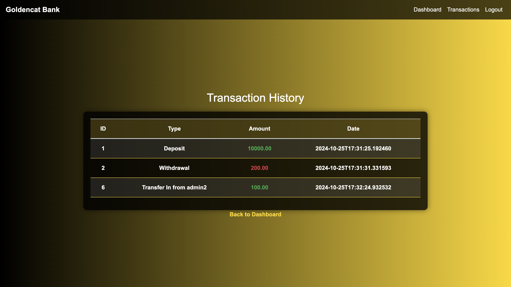

# End-to-End Bank Application Deployment using DevSecOps on AWS EKS

This project demonstrates an end-to-end deployment of a multi-tier bank application written in Java (Spring Boot) using DevSecOps practices. The application is containerized using Docker and can be deployed on AWS EKS (Elastic Kubernetes Service). The application includes user authentication and transaction management.




## Prerequisites

Before proceeding with the deployment, ensure you have the following:

- **AWS Account**: Necessary for provisioning AWS services.
- **Ubuntu EC2 Instance (t2.medium)**: For Docker and Docker Compose setup.
- **Docker**: Installed on your EC2 instance to build and run containers.
- **Docker Compose**: Installed to orchestrate multi-container Docker applications.

### Steps to Deploy the Application

#### 1. Build and Push Docker Image to Docker Hub

First, create a Docker image for your Spring Boot application and push it to Docker Hub for easy access.

- Build the Docker image:
  
  ```bash
  docker build -t bankapp .
  ```

- Tag the image:

  ```bash
  docker tag bankapp:latest joakim077/spring-boot-bankapp:v1
  ```

- Push the image to Docker Hub:

  ```bash
  docker push joakim077/spring-boot-bankapp:v1
  ```

#### 2. Create a Docker Network

Create a dedicated Docker network for the application containers to communicate.

```bash
docker network create bank-network
```

#### 3. Deploy MySQL Container

Run a MySQL container to handle the application's database.

```bash
docker run -itd --name=mysql -e MYSQL_ROOT_PASSWORD=Test@123 -e MYSQL_DATABASE=BankDB --network=bank-network mysql
```

#### 4. Deploy the Bank Application

Run the Spring Boot application container and connect it to the MySQL container.

```bash
docker run -itd --name bankapp -e SPRING_DATASOURCE_USERNAME="root" -e SPRING_DATASOURCE_URL="jdbc:mysql://mysql:3306/BankDB?useSSL=false&allowPublicKeyRetrieval=true&serverTimezone=UTC" -e SPRING_DATASOURCE_PASSWORD="Test@123" --network=bank-network -p 8080:8080 joakim077/spring-boot-bankapp:v1
```

### Docker Compose Deployment

You can also deploy the application using Docker Compose.

- To start the containers:

  ```bash
  docker compose up -d
  ```

- To stop the containers:

  ```bash
  docker compose stop
  ```
